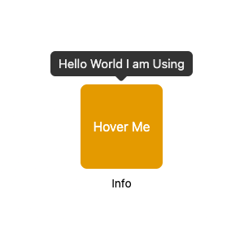
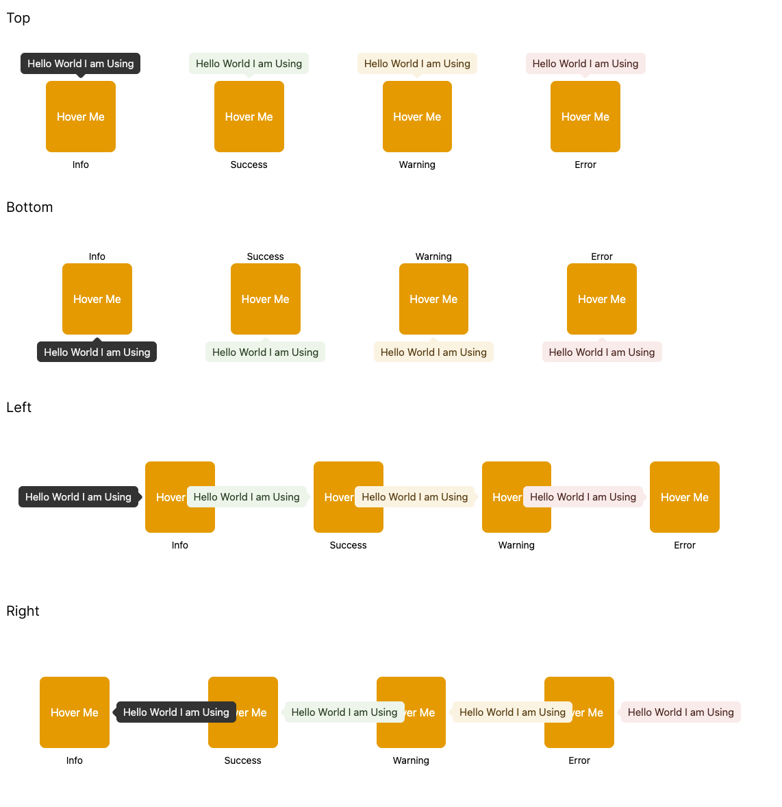

<br/>
<picture>
  <source media="(prefers-color-scheme: dark)" srcset="https://res.cloudinary.com/dub0dpenl/image/upload/v1731780157/Personal%20Logo/logo-white_e6fujz.png">
  <source media="(prefers-color-scheme: light)" srcset="https://res.cloudinary.com/dub0dpenl/image/upload/v1731780152/Personal%20Logo/logo-dark_qqwrqu.png">
  
</picture> 
<br/> <br/>

# @siamf/tooltip
A highly customizable advanced React tooltip component, offering extensive styling options to fit any design needs. It supports dynamic positioning, and custom triggers for enhanced interactivity. Easily integrate it into your `NextJs` project.

<a href="https://www.buymeacoffee.com/siamahnaf" target="_blank"></a>

- Customizations availability
- Easy to use
- Useable directly on `RSC`

# Demo




# Installation

```bash
$ npm i @siamf/tooltip
```

# Usage
```javascript
<Tooltip content="Hello World I am Using" variant="info" placement="top">
    <button className="bg-amber-500 py-10 px-4 rounded-lg cursor-pointer text-white">
      Hover Me
    </button>
</Tooltip>
```

# Available props

<table width="100%">
  <tr>
    <th> Name </th>
    <th> Description </th>
    <th> Type </th>
    <th> Default/Required </th>
  </tr>
  <tr>
    <td> children </td>
    <td> Child element </td>
    <td> ReactNode | JSX.Element </td>
    <td> required </td>
  </tr>
   <tr>
    <td> content </td>
    <td> Content to show on tooltip overlay </td>
     <td> string | ReactNode </td>
    <td> required </td>
  </tr>
   <tr>
    <td> placement </td>
    <td> Tooltip placement </td>
    <td> "bottom" | "left" | "right" | "top" | "bottom-start" | "bottom-end" | "left-start" | "left-end" | "right-start" | "right-end" | "top-start" | "top-end" </td>
    <td> "top" </td>
  </tr>
   <tr>
    <td> trigger </td>
    <td> Trigger Options </td>
    <td> "hover" | "click" </td>
    <td> "hover" </td>
  </tr>
  <tr>
    <td> openDefault </td>
    <td> Default open or not </td>
    <td> boolean </td>
    <td> false </td>
  </tr>
   <tr>
    <td> offset </td>
    <td> Tooltip and button distance </td>
     <td> number </td>
    <td> 10 </td>
  </tr>
  <tr>
    <td> variant </td>
    <td> The interactivity of tooltip style </td>
     <td> "success" | "warning" | "error" | "info" </td>
    <td> "info" </td>
  </tr>
  <tr>
    <td> showArrow </td>
    <td> Either show or hide arrow icon </td>
     <td> boolean </td>
    <td> true </td>
  </tr>
  <tr>
    <td> arrowConfig </td>
    <td> Arrow icon configurations </td>
     <td> ArrowTypes </td>
    <td>  </td>
  </tr>
   <tr>
    <td> className </td>
    <td> Classname for styling </td>
     <td> string </td>
    <td>  </td>
  </tr>
  <tr>
    <td> styles </td>
    <td> CSSProperties for styling inline </td>
     <td> CSSProperties </td>
    <td>  </td>
  </tr>
</table>

### ArrowTypes
<table width="100%">
  <tr>
    <th> Name </th>
    <th> Description </th>
    <th> Type </th>
    <th> Default/Required </th>
  </tr>
  <tr>
    <td> width </td>
    <td> Arrow icon width </td>
    <td> number </td>
    <td> 14 </td>
  </tr>
   <tr>
    <td> height </td>
    <td> Arrow icon height </td>
     <td> number </td>
    <td> 7 </td>
  </tr>
   <tr>
    <td> radius </td>
    <td> Arrow icon corner radius </td>
    <td> number(0-15) </td>
    <td> 0 </td>
  </tr>
   <tr>
    <td> fill </td>
    <td> Arrow icon color </td>
    <td> string </td>
    <td>  </td>
  </tr>
</table>

# Stay in touch

- Author - [Siam Ahnaf](https://www.siamahnaf.com/)
- Website - [https://www.siamahnaf.com/](https://www.siamahnaf.com/)
- LinkedIn - [https://www.linkedin.com/in/siamahnaf/](https://www.linkedin.com/in/siamahnaf/)
- Github - [https://github.com/siamahnaf](https://github.com/siamahnaf)